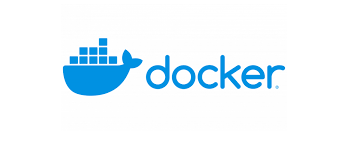

  </a>

	Developed with the software and tools below.

    
    
    
    

## 📝 Overview

This is a repository of challenges to apply the basic concepts of creating containers in Docker using the command lines.

---

## 📦️ Challenges

- [x] Create a Postgresql database
- [x] Create a MySQL database
- [x] Create a MongoDB database

---

## 🏷️ Getting Started

Inside each folder will be instructions for creating the containers.

**System Requirements**

**Docker**: `version 27.4.0`

---